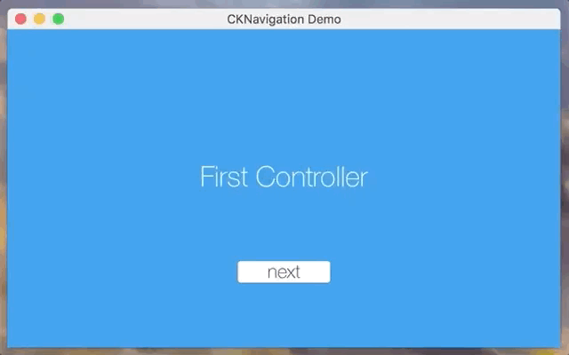

<h1 align="center"><code>CKNavigationController</code></h1>
<p align="center">
  A UINavigationController port for Cocoa development
</p>

<p align="center">
  
</p>

<h2>Usage</h2>
<p>
  The <code>CKNavigationController</code> is meant to provide navigation in a single <code>NSWindow</code> similar to that of UIKit's <code>UINavigationController</code> on iOS. This is a great solution for seperating views in low profile status bar apps and the like.
</p>
<p>
  Implementing a <code>CKNavigationController</code> is almost exactly like <code>UINavigationController</code>. Simply create an instance instance and call <code>.setRootViewController</code> with the controller you'd like to set as root.
</p>

```swift
import CKNavigation

let myController = MyViewController()
let myNavigationController = CKNavigationController()
myNavigationController.setRootViewController(myController)
```

<p>
  This approach is well suited for programmatic user interfaces. You could simply create an <code>NSWindow</code> instance, and add your navigation controller as a subview.
</p>

```swift
import Cocoa
import CKNavigation

class AppDelegate: NSObject, NSApplicationDelegate {

    var navigationController: CKNavigationController!
    
    let controller = ViewController()
    
    let window: NSWindow {
        let content = NSRect(x: 0, y: 0, width: 500, height: 500)
        let window = NSWindow(contentRect: content, styleMask: .closable, backing: .buffered, defer: false)
        return window
    }()
    
    func applicationDidFinishLaunching(_ aNotification: Notification) {
        // add view controller to navigation controller
        navigationController.setRootViewController(controller)
        // add navigation controller to the window
        window.contentView?.addSubview(navigationController.view)
        navigationController.view.wantsLayer = true
        window.makeKeyAndOrderFront(nil)
    }
}
```

<h2>Example</h2>
<p>
  The example that you see in the demo gif, at the top is available <a href="CKNavigationExample">here</a>. This implementation was 100% programmatic.
</p>

<h2>License</h2>
<p>
  MIT &copy; <a href="https://github.com/charliekenney23">Charles Kenney</a>
</p>